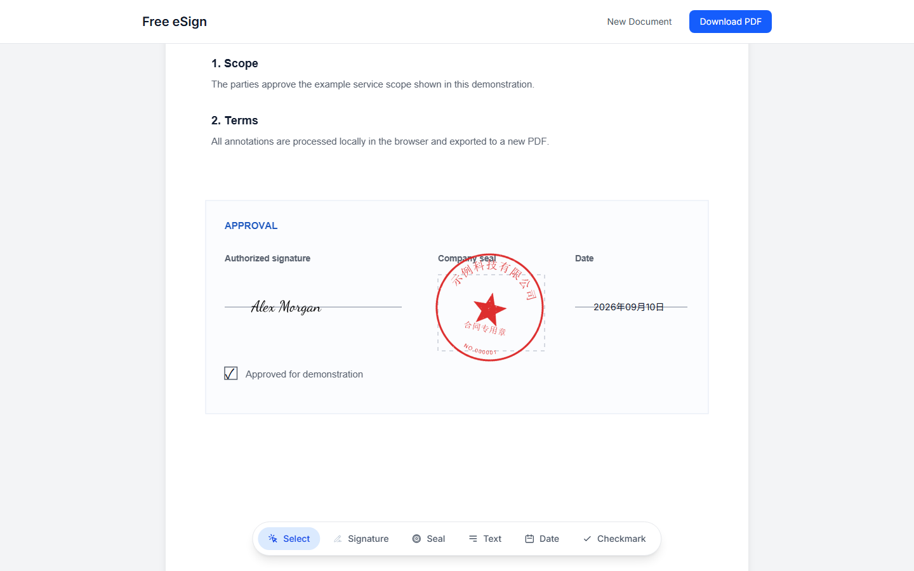
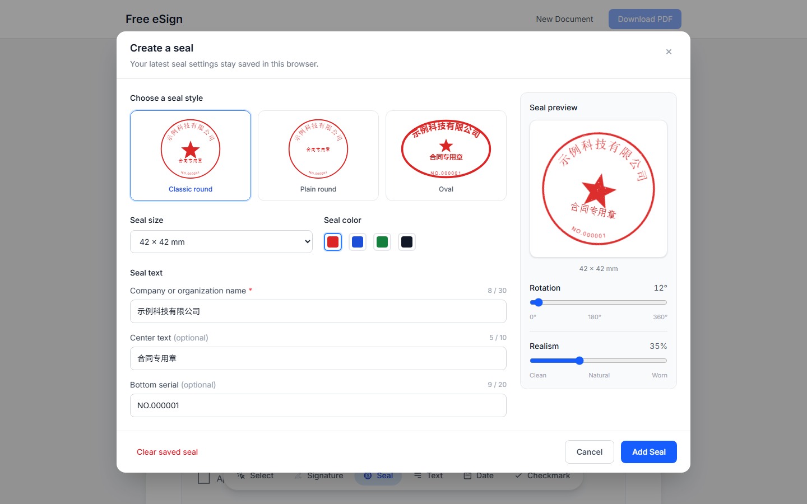
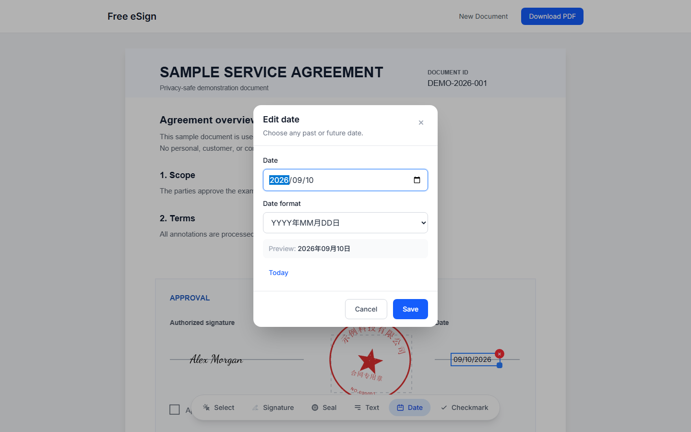

# Free eSign


免费、无需登录的在线 PDF 签署工具。在浏览器中添加签名、印章、文本、日期和勾选标记，然后直接导出已签署的 PDF。PDF 内容会留在你的设备上。

A free, no-login PDF signing tool. Add signatures, seals, text, dates, and checkmarks in your browser, then export a signed PDF immediately. Your PDF content stays on your device.

**在线体验 / Live demo:** [https://esign.byjin.cn/](https://esign.byjin.cn/)



## 功能亮点 / Highlights

- **PDF 处理 / PDF workflow** — 支持拖放或选择多页 PDF，显示读取与渲染进度，并为加载失败提供明确反馈。 / Drag and drop multi-page PDFs with visible loading progress and a clear error state.
- **签名 / Signatures** — 手写、文本转签名或从 5 款签名字体中选择；最近的签名会保存在当前浏览器。 / Draw, type, or choose from five signature fonts; the latest signature is saved in the current browser.
- **印章 / Seals** — 提供经典圆章、简洁圆章和椭圆章，支持尺寸、颜色、文字、旋转、做旧及浏览器本地保存。 / Create round or oval seals with configurable size, color, text, rotation, realism, and browser-local persistence.
- **标注 / Annotations** — 添加文本、任意过去或未来日期、6 种日期格式，以及方块或勾选标记。 / Add text, past or future dates in six formats, and square or check symbols.
- **编辑 / Editing** — 在自适应缩放的 PDF 页面上拖动、缩放、编辑或删除元素；印章缩放时保持比例。 / Drag, resize, edit, or remove placed elements on responsive PDF pages, with aspect-locked seal resizing.
- **撤销与导出 / Undo and export** — 支持 `Ctrl/Cmd + Z` 和 `Ctrl/Cmd + Shift + Z`，并将各类元素按页面缩放与旋转结果准确写入新 PDF。 / Undo or redo changes and export annotations with accurate page scaling and seal rotation.

## 使用方法 / How to use

1. 拖放或选择一个 PDF。 / Drop or choose a PDF.
2. 从底部工具栏选择签名、印章、文本、日期或勾选标记。 / Choose a signature, seal, text, date, or checkmark tool from the bottom toolbar.
3. 在 PDF 上单击放置元素；拖动或缩放调整位置和大小。 / Click the PDF to place an element, then drag or resize it.
4. 双击文本或日期可再次编辑。 / Double-click text or dates to edit them again.
5. 点击 **Download PDF** 下载名为 `*_signed.pdf` 的结果。 / Select **Download PDF** to save the result as `*_signed.pdf`.

## 功能预览 / Feature previews

### 印章编辑器 / Seal editor



### 日期编辑器 / Date editor



## 技术栈 / Tech stack

| 类别 / Category | 技术 / Technology |
| --- | --- |
| 框架 / Framework | Next.js 16.1.3, App Router, static export |
| 界面 / UI | React 19.2.3, Tailwind CSS 4 |
| 状态 / State | Zustand 5 |
| PDF 渲染 / Rendering | pdfjs-dist 5.4.530 |
| PDF 导出 / Export | pdf-lib 1.17.1 |
| 手写签名 / Drawing | react-signature-canvas 1.1.0-alpha.2 |
| 语言 / Language | TypeScript 5 |

## 本地运行 / Getting started

```bash
git clone https://github.com/Eugene0Jin/esign.byjin.cn.git
cd esign.byjin.cn
npm install
npm run dev
```

打开 / Open [http://localhost:3000](http://localhost:3000).

检查并生成静态站点（输出到 `out/`）： / Validate and create the static site in `out/`:

```bash
npm run lint
npm run build
```

## 隐私 / Privacy

PDF 文件的读取、标注和导出都在浏览器中完成，应用不会将 PDF 内容上传到后端服务器。保存的签名和印章配置仅存储在当前浏览器中。

PDF reading, annotation, and export happen in the browser. The application does not upload PDF contents to an application server, and saved signature or seal settings remain in the current browser.
